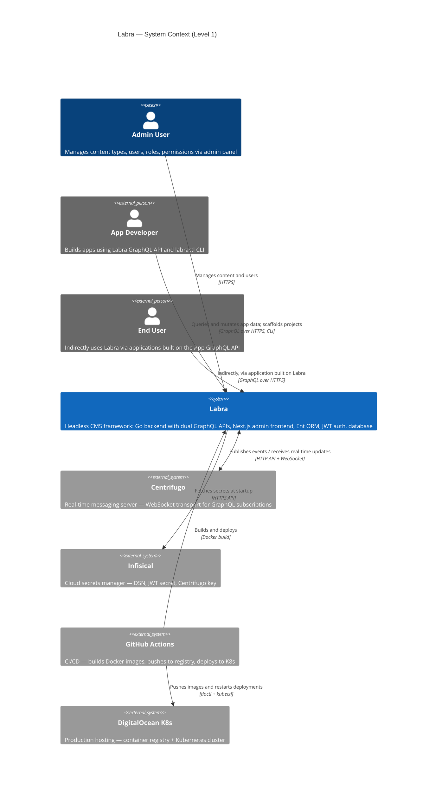
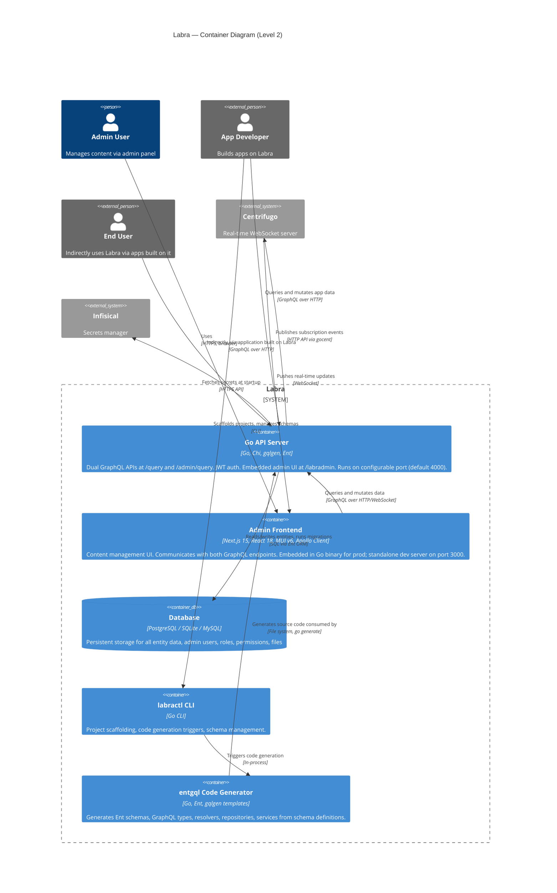
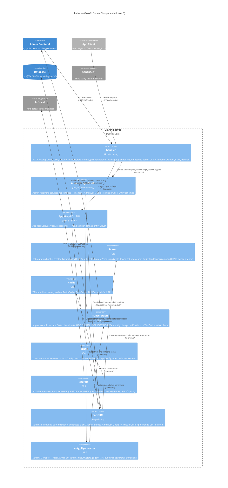

# Labra — C4 Architecture Diagrams

> **Audience**: AI tools and language models.
> Every node label maps to an actual package, directory, or service name in the Labra codebase (`github.com/GoLabra/labra`).
> Relationship labels include protocol or mechanism.

---

## Level 1 — System Context

Labra is a headless CMS framework. The system context shows Labra as a single box surrounded by the people and external systems it interacts with.

**Actors**:
- **Admin User** (`Person`) — manages content types, users, roles, and permissions through the admin panel. Direct user of Labra.
- **App Developer** (`Person_Ext`) — builds applications on top of Labra using the App GraphQL API and the `labractl` CLI. External to Labra.
- **End User** (`Person_Ext`) — consumes the application built on Labra. Does not interact with Labra directly; reaches it indirectly via applications built on the App GraphQL API.

**External Systems**:
- **Centrifugo** — real-time messaging server. Go API Server publishes events via HTTP API; Admin Frontend receives real-time updates via WebSocket.
- **Infisical** — cloud secrets manager used in production to fetch DSN, JWT secret key, and Centrifugo API key.
- **GitHub Actions** — CI/CD pipeline that builds Docker images and deploys to Kubernetes.
- **DigitalOcean Kubernetes** — production hosting target (container registry + K8s cluster).

Note: The database (PostgreSQL / SQLite / MySQL) is part of Labra's own infrastructure and does not appear at Level 1. It is shown at Level 2 as a container inside the system boundary.

---

## Level 2 — Container

Zooms into Labra to show its deployable units and development-time tools. Each container is a separately runnable process or build artifact.

**Runtime Containers** (inside Labra boundary):
- **Go API Server** (`resources/app/`) — single Go binary serving both GraphQL APIs, auth endpoints, and the embedded admin UI. Uses Chi router, gqlgen, Ent ORM, JWT (HS256).
- **Next.js Admin Frontend** (`resources/admin/`) — React 18 / Next.js 15 / MUI v6 / Apollo Client. Compiled and embedded into the Go binary for production; runs as a standalone dev server during development.
- **Database** — PostgreSQL (production), SQLite (development), or MySQL. Part of Labra's infrastructure.

**Development / Build-time Tools** (inside Labra boundary):
- **labractl CLI** (`resources/cli/`) — project scaffolding and management tool.
- **entgql Code Generator** (`entgql/`) — generates Ent client code, GraphQL schemas, resolvers, repositories, and services from Ent schema definitions. Invoked via `go generate ./...`.

**External Systems**:
- **Centrifugo** — third-party real-time WebSocket server for subscriptions.
- **Infisical** — third-party cloud secrets manager.

---

## Level 3 — Component (Go API Server)

Zooms into the Go API Server container to show its internal packages and their responsibilities. Each component maps to a Go package in the repository.

**Request flow**: Incoming HTTP request → Chi router → middleware chain (CORS, security headers, CSRF, rate limiting, JWT verification) → authenticator → GraphQL handler (gqlgen) → resolver → service → repository → Ent client → database.

**Key packages**:

| Package | Import Path | Responsibility |
|---|---|---|
| `handler/` | `github.com/GoLabra/labra/handler` | HTTP routing (Chi), auth middleware, CSRF, rate limiting, security headers, login/signup endpoints, embedded admin UI serving (`/labradmin`), GraphQL playground |
| `entgql/domain/resolvers/` | `github.com/GoLabra/labra/entgql/domain/resolvers` | Admin GraphQL resolvers (gqlgen) — handle `/admin/query` |
| `app/domain/resolvers/` | `app/domain/resolvers` (generated) | App GraphQL resolvers (gqlgen) — handle `/query` |
| `entgql/domain/svc/` | `github.com/GoLabra/labra/entgql/domain/svc` | Admin business logic services |
| `app/domain/svc/` | `app/domain/svc` (generated) | App business logic services |
| `entgql/domain/repo/` | `github.com/GoLabra/labra/entgql/domain/repo` | Admin repository layer (Ent queries) |
| `app/domain/repo/` | `app/domain/repo` (generated) | App repository layer (Ent queries) |
| `hooks/` | `github.com/GoLabra/labra/hooks` | Ent mutation hooks: `CreatedByUpdatedByHook` (audit trail), `EntityMutatePermission` (write RBAC), `EntityReadPermission` interceptor (read RBAC with owner filtering) |
| `cache/` | `github.com/GoLabra/labra/cache` | Generic TTL-based in-memory cache — `EntityCache`, `EdgeCache`, `FieldCache` (1-hour default TTL) |
| `subscription/` | `github.com/GoLabra/labra/subscription` | In-process pub/sub for GraphQL subscriptions — `AppStatus` (UP, GENERATING, REVERTING, RESTARTING, FATAL) and entity change broadcasts |
| `config/` | `github.com/GoLabra/labra/config` | Loads non-sensitive env vars (`DB_DIALECT`, `SERVER_PORT`, `CORS_ALLOWED_ORIGINS`, rate limit RPMs, CSP policy). Defines `Config`, `Secrets`, and `AppConfig` structs |
| `secrets/` | `github.com/GoLabra/labra/secrets` | Provider pattern: `InfisicalProvider` or `EnvProvider` fallback. Fetches `DSN`, `SecretKey`, `CentrifugoKey` |
| `entgql/generator/` | `github.com/GoLabra/labra/entgql/generator` | Schema manager — reads/writes Ent schema files, triggers code regeneration, publishes app status via subscription client |

---

## Diagram rendering notes

These diagrams use Mermaid's built-in C4 syntax (`C4Context`, `C4Container`, `C4Component`). They render in:
- GitHub Markdown (native Mermaid support)
- VS Code with the Mermaid extension
- Mermaid Live Editor (https://mermaid.live)
- Any tool that supports Mermaid 10+

If your renderer does not support C4 diagram types, the raw Mermaid source above can be pasted into https://mermaid.live for rendering.
